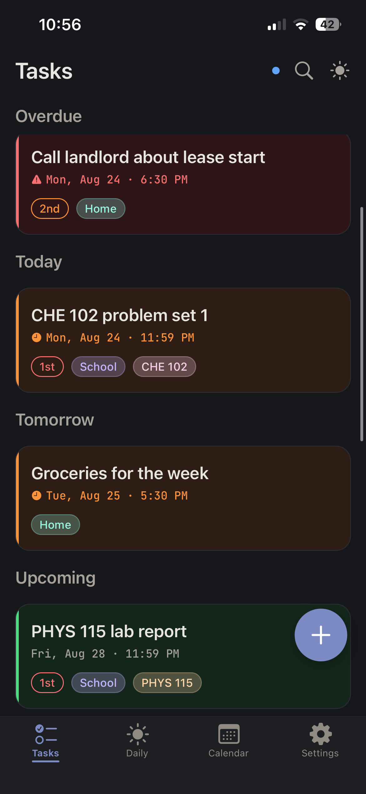
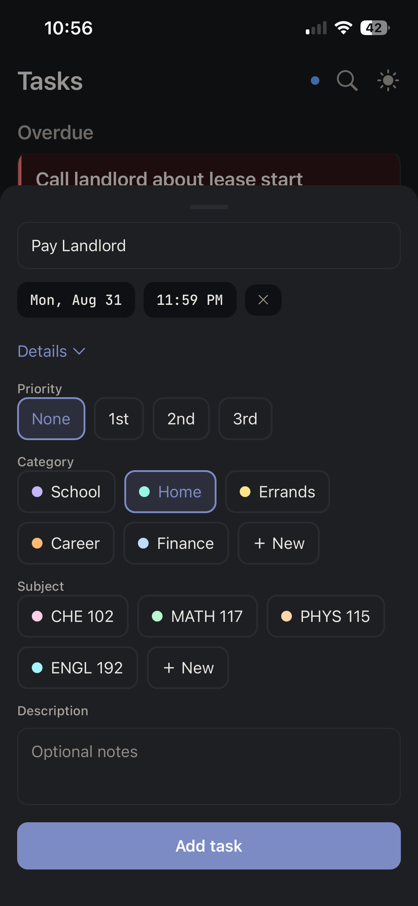
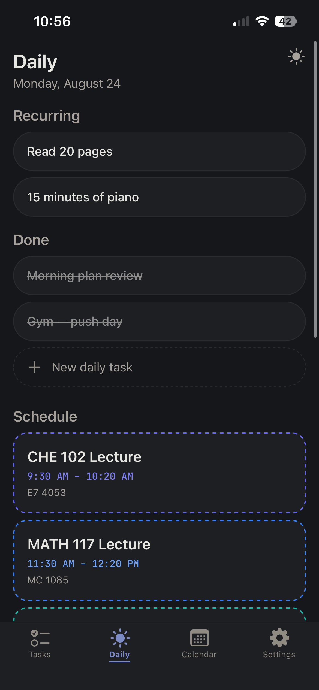
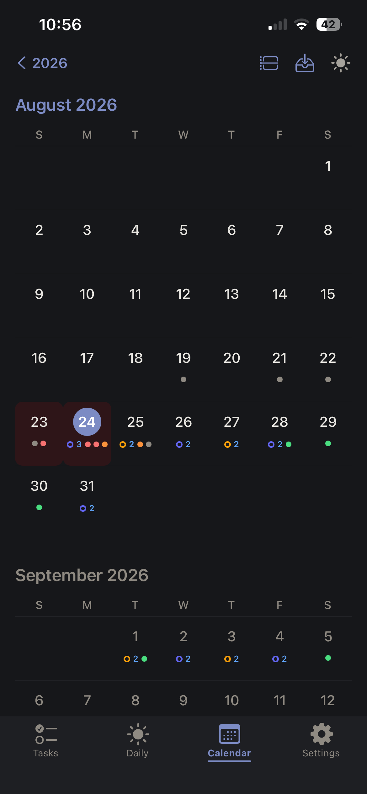
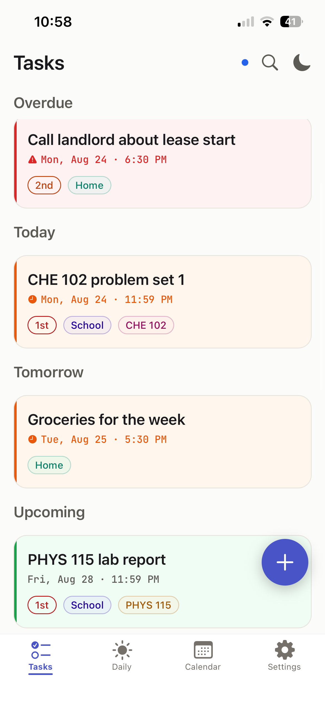
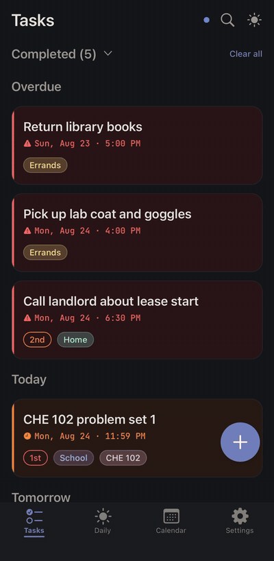
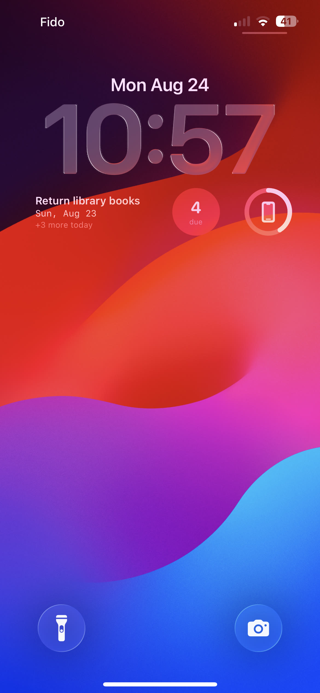
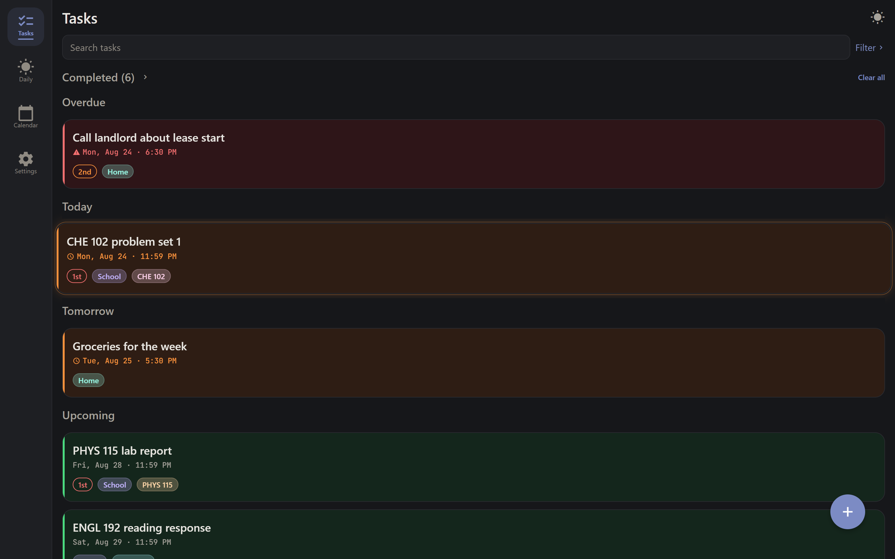
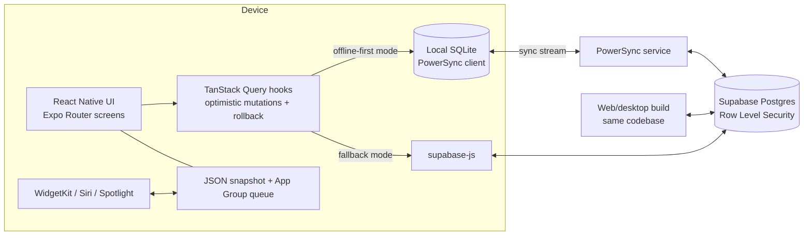

# Multitask

**Multitask is an offline task manager that is available on a number of platforms and represents the second generation of the application which I have been developing and running since April 2026.**

iOS (TestFlight, App Store submission in progress) · Web/desktop (deployed from this repo) · Android (builds green, Play release planned for v2)

> 🔗 **Live web app:** https://multitask-web.onrender.com. **iOS beta (TestFlight):** https://testflight.apple.com/join/zf5DCZvB. **v1 (original Java web app):** [jckyii/taskmanager](https://github.com/jckyii/taskmanager). Still live at https://taskmanager-gcvv.onrender.com.

<p align="center">
  
  
  
  
  
</p>

<p align="center">
  
  
</p>

<p align="center">
  
</p>

## The short version

Multitask is a task manager designed for students and for anyone who relies on due dates, focusing on one main question: "What is due and when?" The first step is to create a task. Each task includes a title, a due date and time, a description, a category, a subject, a priority level, and also has a live status that updates for each task (from ongoing to urgent to overdue). The tasks continue to be available on all pages, such as the standard list view, the daily view, the calendar, the widgets, and the notifications — and the entire system works offline, with synchronization taking place when a connection is restored.

V2 is a completely new native version of the application, based on the same data and product principles as the one I originally designed, built, and deployed first (version 1, approximately 4,600 lines of Java, with real users and which is still running), featuring a redesigned way of interacting with users, an offline-first architecture, and deep integration with the operating system.

## Why a v2 exists

I developed the first version (from April to June 2026: using Java 24, Spring Boot 4, Vaadin Flow, Supabase Postgres, and deploying it on Render: 65 commits and 14 pull requests) and used it every day. Three limits became apparent:

1. **It functioned only when used over the internet**; with a server-rendered user interface, there would be no tasks if there was no connection.
2. **The framework placed limitations on the design**; although Vaadin is productive it is design-restrictive since the kinds of interactions I wanted (swipe gestures, physical motion, one-hand quick capture) could not be achieved.
3. **A task manager is available on your phone.** The web app didn't have any widgets, no notifications, no Siri, and no presence on the lock screen, whereas a phone browser isn't the appropriate place for a tool that is used every day.

Version two reverses the architecture: instead, the React Native application becomes the definitive source of the design, the backend is now set up to go directly to Supabase using Row Level Security (with no app server in the data pathway), and the web version has become a build target of the same codebase—one design, one logic layer, for all platforms.

The two generations use a single database; when a v1 user registers in v2 using the same email, their previous tasks appear automatically (this is achieved through an email-matching backfill together with an insert trigger — there is no need for a migration step or for a support ticket).

## Design philosophy

I prepared the design system before designing the first screen: it consisted of **13 design documents** (about 3,600 lines in the docs/ folder) which dealt with components, layout/type/color, gestures, motion, platform conventions, and also included an "anti-generic" checklist, the purpose of which was to ensure that the app didn't end up looking like every other template task app.

The summary consists of three words: **calm, precise, and tactile.**

- **Calm** is primarily a productivity tool since the visuals don't take away from the content. Each screen should have just one main action. High density is a feature in that it doesn't include any whitespace which would require the user to scroll.
- **Each value is selected rather than set as a default.** The threshold for the swipe commit is 16.18% of screen width; the duration of the list re-entrance animation is 647.2 ms with an ease-out effect; the card status tints are precise tokens that are carried over from v1's visual DNA.
- **Tactile** — the purpose of motion is merely to provide orientation, give feedback, or indicate continuity. The swipes follow the finger, come to rest on a spring that has been adjusted, and each animated value was individually tuned on an actual phone.

Above all else there are two strict rules: **status must never be shown simply by colour** (icons, borders and weight must always be used — it has to be an accessibility feature, not a preference), and **title together with the due date must be readable at a glance**; if a badge and the title are competing for space then the badge is lost.

## Feature tour — what each piece is for

The intent behind each of the features described below is the one it was designed to address, since each of them eliminates a particular point of friction.

### Capture: quick-add

**What happens** is that a floating button appears and opens a bottom sheet with the keyboard already displayed. The title together with "Add task" makes up a complete task. The date and time can be set with a single tap (there is an inline calendar, a minute-accurate wheel, and the default is today at 11:59 PM). The description, priority, category, and subject are contained in a collapsed "Details" section, including colored chips for the existing categories and subjects and a "+ New" option for creating new ones.

**The reason** is that the entire app depends on how quickly captures can be made. The design budget is ten seconds from the time the title appears until it is saved, all optional features are positioned so that they are no more than one tap away, and the default of 11:59 PM is in line with the way deadlines actually function.

### The list: status-driven cards, swipes, and undo

**The task categories are divided into Overdue, Today, Tomorrow, Upcoming**, and with Completed and Deleted shown as collapsed sections. Each card has a status accent bar and a tinted background (using green for ongoing tasks, orange for urgent ones and red for overdue ones — that is the visual heartbeat from version 1, refined), a monospaced due date, and small pills indicating priority, category, and subject. Swipe right to mark the task as complete and swipe left to delete — in the style of Mail — with haptic feedback and a coloured action trail. All changes are designed to be optimistic and include a rollback option, and any destructive action is followed by a 5-second undo toast rather than a confirmation dialog.

**The reason** is that using the device should require no effort at all—instead, the entire surface of the card responds to the question of how urgent it is before any words are read. Swiping serves as the two most common actions, becoming part of one-handed muscle memory. The option to undo rather than confirm helps to keep the process both quick and safe: since confirmations penalise the 99% in order to protect the 1%, it is the undo function that offers protection for everyone. Deletion is carried out as a soft delete sent to a Trash folder because 'oops' should never be permanent by default.

### Urgency that matches your threshold

A task is marked as "urgent" N hours before its deadline—N is different for each user (the options are 12, 24, 48 or 72 hours, with 48 hours as the default)—this setting is found in Settings and determines the card colour, the way lists are grouped, the calendar tinting, and when the notifications are sent.

**The reason** is that the term "urgent" has different meanings for a student and for a contractor; by making the threshold a user setting, the colour system gives an accurate account for all users.

### Daily view

**This consists of** a dedicated tab for recurring daily tasks (habits and routines) featuring tap-to-check circles and a 'Done' section, together with all the items due today (including scheduled events).

**The reason** is that repeated daily entries should not be included on a calendar since they would hide actual deadlines beneath a clutter of entries. 'Done today' is saved as a completion entry for the local date and therefore the daily reset at midnight is derived rather than set: there is no need for a cron job, there are no timezone problems, and the system works when used offline.

### Calendar: year → month → day

**What:** A monthly grid featuring task marks in different colours according to their status, event rings, a year-view option that shows the number of items for each month, a weekly view, and a daily level of detail that displays a timeline—with the entire day forming the axis against which events are positioned to scale, tasks placed at their due times, and any empty periods lasting three hours or more condensed into labelled gaps so that the busy hours remain readable.

**Reason:** Deadlines have a spatial aspect to them. The zoom hierarchy addresses three different questions — 'How is my year/month/day looking?' — using the same data. On the desktop, the day view is divided into two panes (one for the timeline and the other for the task cards) since there is width available to use.

### Events and CSV import — tasks are not events

**What happens** is that a calendar is able to import external schedules (such as class timetables and work rosters) in the form of a CSV file. The imported events are a distinct type—they have dashed borders, a calendar icon, and hollow rings on the monthly grid, which makes them easily distinguishable from tasks—and by design they are read-only (operations allowed include import, viewing, and deletion, but not editing). The parser is intentionally lenient: it allows for fuzzy matching of column names, accepts multiple date and time formats, and gathers errors on a per-row basis while still importing the valid rows. There is an in-app help sheet which includes a copyable AI prompt that can convert any disorganised schedule into a valid CSV, and alternatively the rows can be imported as tasks if that is actually what they are.

**The reason** is that your schedule serves as context while your tasks represent commitments; it was this mistake that caused me to abandon Google Tasks during the first version's research. By using import-only events, the source of truth remains external (re-importing is better than manually editing a copy), and a lenient parser has been included since real users' CSV files are never clean.

### Notifications that respect the model

**The app sends** two local notifications for each task: one when the task becomes urgent (when it reaches your set threshold) and another as a reminder before the deadline (the amount of lead time available can be set at 30 minutes, one hour or two hours); the number of tasks that are overdue is shown by the app badge. When you tap a notification it takes you directly to the edit sheet for that task and there is a 'Complete' action button which allows you to finish the task without having to open the app.

**The reason** is that the notifications use the same urgency scale as that shown on the interface, so a buzz never contradicts what is on the screen. Since local scheduling is used (with no push server), reminders function without any backend support and without any tracking.

### Offline-first sync

**What:** The entire data layer functions without needing a connection—creation, editing, completion and deletion all take place instantly in a local SQLite database and are synchronized through PowerSync as soon as connection is restored. Changes made concurrently using the web app are reflected in real time. A small status dot indicates whether the system is online, syncing or offline, and any permanently rejected writes appear in a toast and in Settings rather than disappearing silently.

**The reason** is that if a task manager requires Wi-Fi then you lose trust in it. The rule I have established is that offline mode is invisible—the behaviour in airplane mode is the same as when online except for the dot. Actually achieving this took proper engineering: it involved creating an offline ID that wouldn't collide with the Hibernate sequence of the v1 server, ensuring that uploads could be replayed via Supabase so that Row Level Security still applies to each write, and implementing a permanent-error classifier so that a single bad row wouldn't cause the queue to become blocked. This has been verified by a complete airplane-mode test: making offline edits on the phone, then reconnecting, and seeing the changes appear on the website—in both directions.

### Deep OS integration (iOS)

**This includes** home screen widgets (small, medium, and large) and lock screen widgets (rectangular or circular) which display what is due and allow for interactive tick-off directly from within the widget (using iOS 17 App Intents, the tasks being queued through an App Group and then processed by the app); the ability to create tasks using Siri via App Shortcuts; tasks being indexed by Spotlight; long-press quick actions; action options available in notifications; and an optional mirror of tasks that have been dated into the system Calendar app (this is a true reconciler since it keeps only the events that have been marked by it and completely removes them when the option is turned off).

**The reason** is that the simple answer to the question 'what's due?' should require no opening of the app. Each integration was selected on the basis of whether or not it would make the user faster, and the flashy WWDC features such as on-device AI and visionOS were specifically rejected because they failed that test.

### Web and desktop, same codebase

**What is the case** is that the same repository provides a web-based single-page application (deployed on Render), featuring on wide screens a left-hand navigation rail, hover interactions serving as a replacement for swipes (with status-colored glows and edge action zones), a search function that remains permanently open, a two-pane daily timeline, and a light/dark mode option on each tab; browser notifications replicate the native triggers.

**The reason** is that the endgame for V2 is to replace the v1 website with this design. Although cross-platform consistency would suggest a uniform approach, platform conventions take precedence—a mouse should have hover states, not fake swipes—yet there is still a single design system, one logic layer, and one test suite underneath.

### Onboarding that teaches by doing

**It's a** 22-step interactive tour designed for new users: during this tour you actually build a task using the quick-add sheet (by entering the details, setting the priority, and choosing between category and subject), swipe it to delete it, undo the action, mark it as complete, add a daily task, navigate among the different zoom levels of the calendar, and find the search and import and settings options—there being wrong-action fail-safes that dim the interface but never prevent scrolling.

**Reason:** Swipe actions and the division by category/subject remain invisible until they are displayed for the first time. The tour demonstrates the actual user interface with real changes (on the task of the tour itself, tracked by id) since a passive screenshot carousel provides no useful information.

### Accounts, privacy, and the boring-but-critical parts

**What this includes** is verified email with Supabase Auth (note that this verification serves as a security invariant in this case, not just a checkbox — it is what ensures that the feature linking users with the same email when moving from version 1 to version 2 is safe), branded transactional emails, requiring re-authentication before making sensitive changes, in-app account deletion (involving two confirmations and a server-side RPC wipe), public versions of the privacy policy, terms of service, and support pages, and a security-hardening migration that was prepared following an adversarial audit (which had identified and closed vulnerabilities relating to column injection, account-linking takeover, and denial-of-service attacks).

**Reason:** The app stores users' plans; each table has row level security, the client is regarded as untrusted, deletion is real and can be carried out by the user (this is also required by the App Store — 5.1.1(v)); and the privacy page lists all the processors since users have a right to see the full list.

### The theme system (and what it's protecting)

**What is happening** is that each color, font, radius, and duration passes through a single token layer (lib/theme/), all the cards go through one TaskCard, and all the gestures are handled by a single swipe engine; light and dark modes are now available, and a curated 'style pack' system (consisting of swappable visual skins, validated declarative bundles, with no code execution and no sideloading) is set up behind a 'coming soon' screen.

**The reason** is that in today's architectural discipline a product's surface of tomorrow—such as visual packs and eventually a curated marketplace—is produced without allowing any skin to violate the accessibility contrast rules or the calm-first principles. Since the very first slice, it has been enforced that nothing in a screen should hard-code a visual value.

## Architecture



Decisions worth calling out:

- **There is no application server**; the clients communicate with Postgres via Supabase using RLS as the only authorization layer, and when offline writes are replayed they are done so through the same authenticated client, which means the sync process cannot bypass security.
- **The system uses a dual-mode data layer** and, for each operation, branches according to whether the sync engine is available: it uses local SQLite in that case and makes a direct call to Supabase REST if the sync engine is not available. The app continues to function in the standard Expo Go version, in the web build, and in the full development build — all based on a single codebase, with graceful capability detection (the same pattern is used to control every native module: widgets, Siri, quick actions, and the device calendar).
- **The rule on date discipline** involves using timezones in a timezone-naive way ("Friday 11:59 PM" means what it means on your wall clock, no matter where you are). Date calculations are based on their components; it is prohibited to apply toISOString to a due date. This single rule got rid of the whole category of off-by-a-day bugs that the v1 version had to deal with.
- **The numbered SQL migrations** (supabase/00–12) involved schema inspection, RLS enablement, the creation of policies, implementation of soft delete, the setup of recurring tasks, the handling of events, preparation for sync, security hardening, and account deletion—each of them being executed and verified against the live database in order.
- **The logic has been tested and the user interface is simple.** Grouping, filtering, determination of status, calendar calculations, parsing of CSV files, layout of the timeline and taking snapshots of widgets—all of these are pure functions with unit tests. The different screens put them together.

## How it was built (process)

The part that I'm most proud of was building v2 as a product, not as a demo.

1. **The design system should be developed first**; the 13 documents in docs/design/ were prepared before any UI code was written, including the anti-generic checklist against which every screen is audited.
2. **The vertical slices were checked on the device itself.** As the app developed, it was tested across a series of reviewed slices (tokens/list → swipes → trash/motion → quick-add → daily → editing → bulk actions → calendar → settings → search → notifications → CSV import → …), each segment being followed by an on-phone review and a manually tuned session before the next one started. The motion values were finalised on the actual hardware, not in a simulator.
3. **It is becoming more extensive.** Each new slice is subject to pure-logic testing and the collection of tests only increases — there are now 168 tests distributed among 23 suites, all showing as green — together with a scripted 22-step end-to-end benchmark for the onboarding tour. Nothing is released if a suite shows as red.
4. **Adversarial audits:** a full-repo review covering the aspects of correctness, security, and accessibility resulted in a written report and a specific security-hardening migration; an independent AI review tool (CodeRabbit) is applied to the release diffs. Any findings were turned into fixes complete with tests or were documented as deferrals—silence was never used.
5. **An accessibility pass against Apple's Human Interface Guidelines**, including VoiceOver actions for swipe-only gestures, announcing toasts, raising the contrast level to 4.5:1, providing Dynamic Type support only where the geometry requires it, setting targets at 44pt, and respecting reduced-motion in all cases.
6. **This involves actual release engineering:** the EAS cloud builds (which are developed on Windows and are deployed to iOS), explicit support for iOS 15.1 (with each pod verified and pinned so that a dependency update fails clearly), an App Store submission package that is ready to paste in and includes accurate privacy labels, and TestFlight rounds with the feedback being sorted into a written backlog—currently in its second round.
7. **All information is recorded.** Whenever a decision is made, the reasons for it are included in the design documents or the project log. The repository can be understood by a stranger – or by me six months from now.

**How this was built:** I designed the product and directed an AI-assisted implementation — the code in this repo was written with Claude Code, an AI coding agent, working under my direction. Every feature began as a specification I wrote first: behaviour, UI states, edge cases, and what not to build, because the project's earliest lesson was that an under-specified requirement makes an AI ship the wrong assumptions. Treating an AI agent as a directed engineering tool — one that gets written specifications, review checkpoints, and a benchmark it cannot dispute — is itself a skill this project taught me.

The hand-written code is in [v1](https://github.com/jckyii/taskmanager): ~4,600 lines of Java I wrote myself as my Computer Programming 12 final project. The two repositories are deliberately different proofs — v1 shows I can write the code; this one shows I can specify, direct, and verify a build several times that size.

*Although the design period may have been short, it does feel as though countless days and nights were spent pondering its design, every little bit of UI, and all of the features. It is safe to say this has been one of the biggest solo projects I have embarked on, and it won't be the last work I create. This has been a personal project of mine, and I do hope that this application will help those in need of a way to manage their time.*

## By the numbers

| | v1 (web, Java) | v2 (this repo) |
|---|---|---|
| Timeline | Apr–Jun 2026 | Jul 2026 – present |
| Code | ~4,600 lines Java (Vaadin/Spring) | ~14,500 lines TypeScript + 565 lines Swift |
| Tests | manual | **168 automated (23 suites) + scripted E2E tour** |
| Commits | 65 (14 PRs) | 183 |
| Screens/routes | 8 | 19 |
| Platforms | web | iOS · web/desktop · Android (built) |
| Database migrations | Hibernate auto-DDL | 13 numbered, hand-run SQL migrations |
| Design docs | — | 13 documents (~3,600 lines) |
| Offline | none | full offline-first with two-way sync |

## Stack

**App:** React Native 0.81 · Expo SDK 54 (Expo Router, dev client) · TypeScript · TanStack Query · Reanimated + Gesture Handler · jest-expo

**Data:** Supabase (Postgres + Auth + Storage, Row Level Security) · PowerSync + op-sqlite (offline sync) · wall-clock date engine

**Native:** WidgetKit (Swift) · App Intents / SiriKit · Spotlight · expo-notifications · expo-calendar · expo-quick-actions

**Delivery:** EAS Build/Submit (iOS + Android) · Render (web SPA + v1 site) · TestFlight

## Running it

```bash
npm install
cp .env.example .env             # Supabase URL + anon key (+ PowerSync URL for sync mode)
npx expo start                   # Expo Go covers the full UI in online mode
npm test                         # 168 tests
npx expo export --platform web   # the deployed web build
```

Offline sync, widgets, Siri, and quick actions need a dev build (`eas build --profile development`) — every native capability degrades gracefully when absent, so the core app runs anywhere.

## Roadmap

App Store v1 (in review pipeline) → v1.1 (iPad — the wide layouts are already merged behind one flag — plus TestFlight backlog) → Android/Google Play → desktop (Tauri wrapper) → this design replaces the v1 website → Apple Watch → curated style-pack marketplace.

## License

All rights reserved. The code is public for reading and evaluation; it isn't licensed for reuse.

## Author

Jack Yi — [github.com/jckyii](https://github.com/jckyii) · [linkedin.com/in/jack-yii](https://www.linkedin.com/in/jack-yii)
